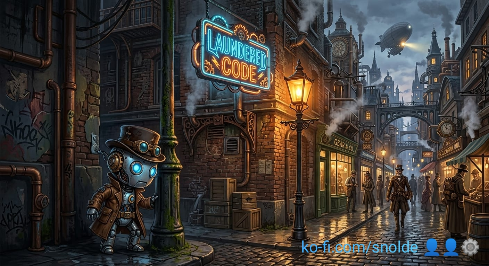

# SWE by Gaslight 
_GenAI code generation demasked_

This repository contains code samples and session transcripts used in a current work in progress, **"Software Engineering by Gaslight"**. It is a documentation of how code generation with GPTs works.

In a nutshell, these examples are based on a first semester problem of technical informatics for engineering students.
The complexity is high-school level and can be solved by adequately educated freshmen before they formally learn algorithm engineering.

A word of warning: what you get to see here might disturb you if you ever shipped GPT generated code to production without reverse engineering every single line of code to determine semantical equivalence with your specifications and architecture.

Please kindly consider to support my work at https://ko-fi.com/snolde

## Content

The repository contains:
- [Problem](problem.py) class - the problem in code. It is a programatic version of a variant 4 cups rotating disc puzzle that can be solved by a deterministic algorithm.
- [Solver](solver.py) class as a human written reference. As part of a referential benchmark, the code is published under a license prohibiting genAI training.
- The [No Training License](LICENSE.no-training) aiming to prevent benchmark hacking.
- [ClaudeGeneration](ClaudeGeneration.md) and [ClaudeGenerationAlt](ClaudeGenerationAlt.md) as two transcripts of code generation with Anthropics Claude GPT. In the alternative generation a working artifact [claude-alt](claude-alt.py) was achieved in the end through brute force instruction guessing after pattern matching an adjacent, non deterministic solution.
- [chatGPTGeneration](chatGPTGeneration.md) with 5 consecutive generated probabilistic solvers and the conclusion a deterministic solution was impossible
- Three Gemini artifacts, [gemini](gemini.py), [gemini2](gemini2.py) and [gemini3](gemini3.py), none of them correct solutions. Since Gemini does not load that specific session, I let the code speak for itself, until the next test round.

